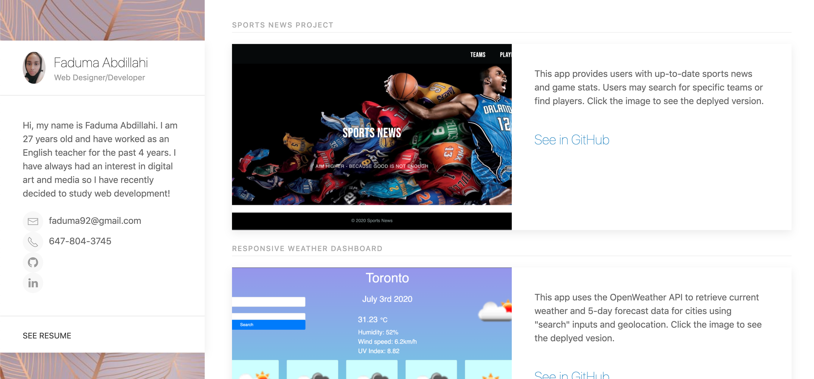

## Updated-Portfolio

Link to portfolio:  

ScreenShot of portfolio:

# Updated the following on Portfolio:

- Your name

- Links to your GitHub profile & LinkedIn page as well as your email address and phone number

- A link to a PDF of your resume

- A list of projects. For each project, I made sure to include the following:

    - Project title

    - Link to the deployed version

    - Link to the GitHub repository

    - Screenshot of the deployed application

Design is:
- Polished
- Mobile-first design
- Font size is large enough to read, and  the colors don't cause eye strain

I have also updated the following on my GitHub Profile:

- Profile picture

- Bio

- Location

- Email

- Link to your portfolio

I have also updated  my Resume:
- Submitted a clear, concise and compelling resume, tailored to the type of job I am looking for

Updated LinkedIn Profile:
- Added a bio statement, a professional photo, and links to my Github and portfolio
